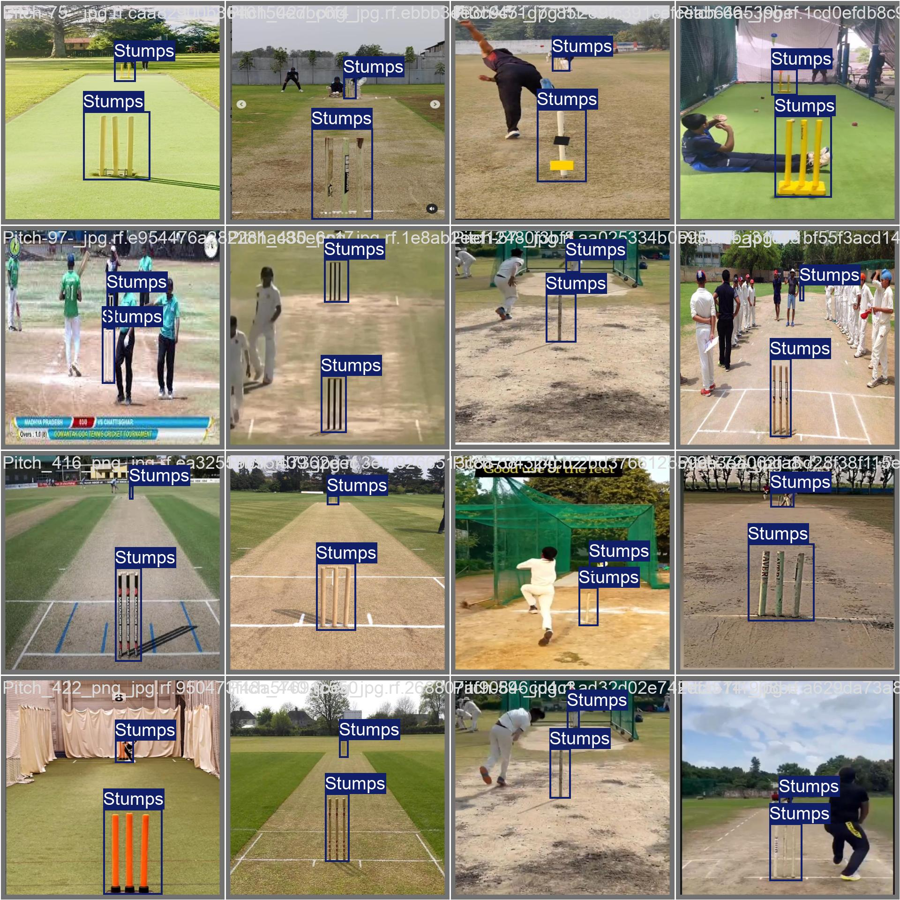

# 🏏 Cricket Prediction using YOLOv8

This project uses the [Ultralytics YOLOv8](https://github.com/ultralytics/ultralytics) object detection model to detect cricket-specific entities such as **Ball**, **Bat**, **Person**, **Stump**, and **Stumps** from videos.

## 🔍 Model Overview

- **Model**: YOLOv8 (custom trained)
- **Framework**: Ultralytics YOLO
- **Classes**:  
  ```python
  {
    0: 'Ball',
    1: 'Bat',
    2: 'Person',
    3: 'Stump',
    4: 'Stumps'
  }
  ```

## 📦 Features

- Detect cricket objects in real-time video
- Save annotated output video
- Easy integration with other CV tasks
- Optional logo/banner overlay on video frames

## 🚀 How to Run

### 1. Clone the Repository

```bash
git clone https://github.com/alihassanml/Cricket-Prediction-Yolov8.git
cd Cricket-Prediction-Yolov8
```

### 2. Install Dependencies

```bash
pip install ultralytics opencv-python
```

### 3. Place Files

- Put your **trained model** at: `./model/best.pt`
- Put the **input video** as: `video.mp4`
- (Optional) Place a **logo image** as: `logo.png`

### 4. Run Inference

```bash
python run.py
```

The output will be saved as `output.mp4`.

## 📂 File Structure

```
├── model/
│   └── best.pt             # Trained YOLOv8 model
├── video.mp4               # Input video
├── output.mp4              # Output with detections
├── run.py                  # Main script
├── logo.png                # Optional banner image
└── README.md
```

## 📸 Sample Detection



## 🤝 Contributing

Feel free to fork and submit pull requests to improve detection, add analytics, or extend to pose estimation.

## 📜 License

MIT License

---

Made with ❤️ by [Ali Hassan](https://github.com/alihassanml)
```

---

